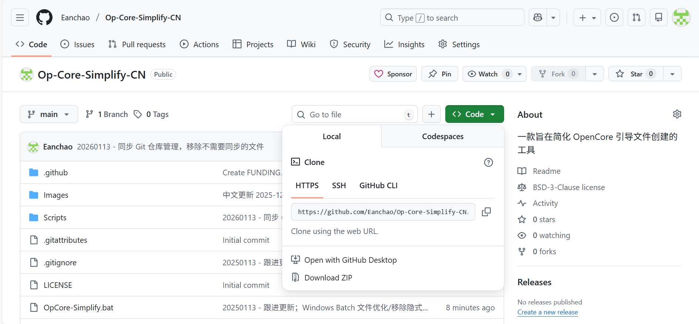
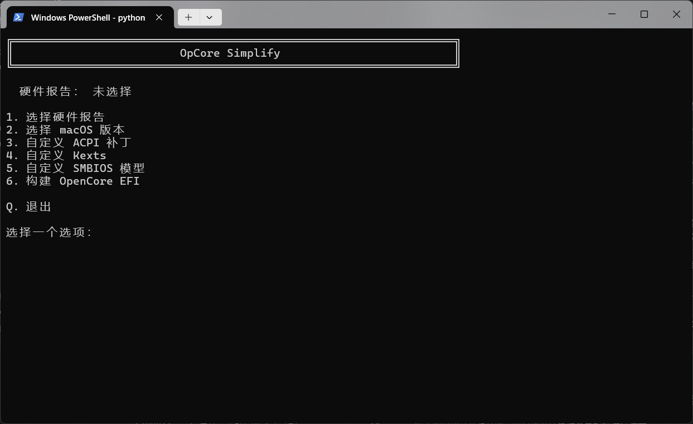
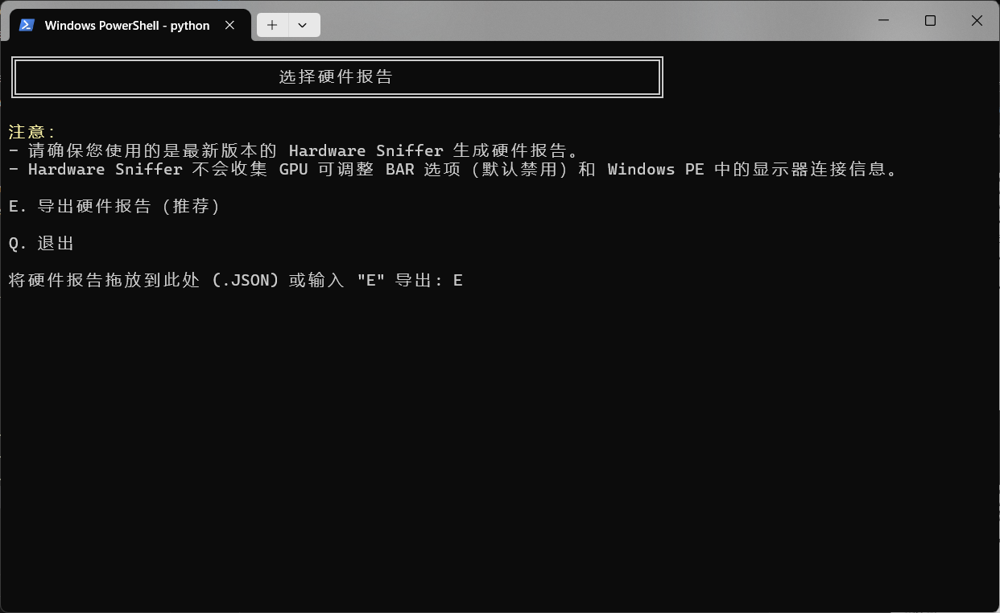
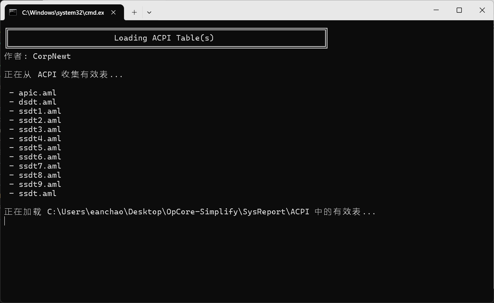
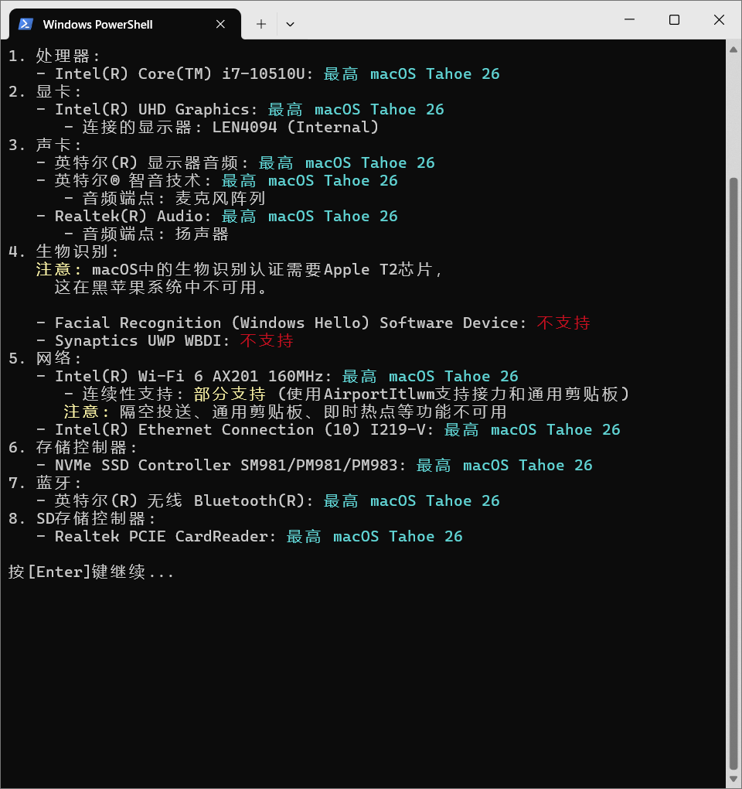
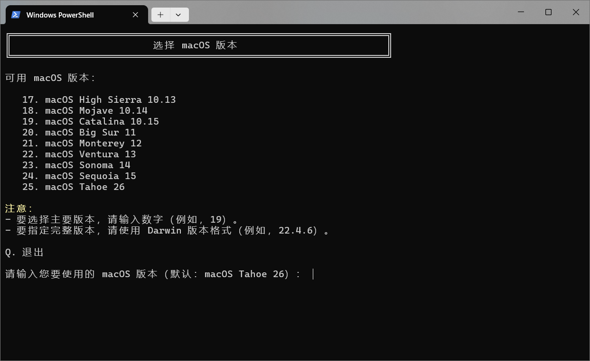

<br/>
<div align="center">
  <h3 align="center">OpCore Simplify</h3>

  <p align="center">
    一款专门用于简化 <a href="https://github.com/acidanthera/OpenCorePkg">OpenCore</a> EFI 创建的工具，通过自动化核心设置流程并提供标准化配置。旨在减少手动操作，同时确保黑苹果（Hackintosh）安装过程的准确性。
    **译者注：发现部分人 Fork 了本仓库。译者严重声明！本项目因翻译中文对部分执行源码进行了修改（或增加部分方法）！用以正确显示中文，请勿随意更改！**
    <br />
    <br />
    <a href="#-特性">特性</a> •
    <a href="#-使用方法">使用方法</a> •
    <a href="#-贡献">贡献</a> •
    <a href="#-许可证">许可证</a> •
    <a href="#-致谢">致谢</a> •
    <a href="#-联系方式">联系方式</a>
  </p>
  
  <p align="center">
    <a href="https://trendshift.io/repositories/15410" target="_blank"></a>
  </p>
</div>

> [!NOTE]
> **OpenCore Legacy Patcher 3.0.0 – 现已支持 macOS Tahoe 26！**
> 
> 期待已久的 OpenCore Legacy Patcher 3.0.0 版本现已发布，为社区带来了 **对 macOS Tahoe 26 的初步支持**！
> 
> 🚨 **请注意：**  
> - 只有来自 [lzhoang2801/OpenCore-Legacy-Patcher](https://github.com/lzhoang2801/OpenCore-Legacy-Patcher/releases/tag/3.0.0) 仓库的 OpenCore-Patcher 3.0.0 **提供了带有早期补丁的 macOS Tahoe 26 支持**。
> - 官方 Dortania 版本或旧补丁 **将无法与 macOS Tahoe 26 配合使用**。  

> [!WARNING]
> 尽管 OpCore Simplify 大大减少了设置时间，但黑苹果（Hackintosh）之旅仍然需要：
> - 理解 [Dortania Guide](https://dortania.github.io/OpenCore-Install-Guide/) 中的基本概念
> - 在安装过程中进行测试和故障排除
> - 耐心和坚持解决出现的任何问题
>
> 我们的工具不能保证首次尝试就能成功安装，但它应该能帮助您开始的黑苹果不必迷茫。

## ✨ **特性**

1. **全面的硬件和 macOS 支持**  
   完全支持现代硬件。使用 `Compatibility Checker` 检查支持/不支持的设备和支持的 macOS 版本。

   | **组件**  | **支持情况**                                                                                       |
   |----------------|-----------------------------------------------------------------------------------------------------|
   | **CPU**        | Intel: Nehalem 和 Westmere（第 1 代）→ Arrow Lake（第 15 代/Core Ultra Series 2） <br> AMD: Ryzen 和 Threadripper（配合 [AMD Vanilla](https://github.com/AMD-OSX/AMD_Vanilla)） |
   | **GPU**        | Intel iGPU: Iron Lake（第 1 代）→ Ice Lake（第 10 代） <br> AMD APU: 整个 Vega Raven ASIC 系列（Ryzen 1xxx → 5xxx, 7x30 系列） <br> AMD dGPU: Navi 23, Navi 22, Navi 21 代，以及更早的系列 <br> NVIDIA: Kepler, Pascal, Maxwell, Fermi, Tesla 架构 |
   | **macOS**      | macOS High Sierra → macOS Tahoe |

2. **ACPI 补丁和驱动**  
   根据硬件配置自动检测并添加 ACPI 补丁和驱动。
   
   - 与 [SSDTTime](https://github.com/corpnewt/SSDTTime) 集成，支持常见补丁（如 FakeEC、FixHPET、PLUG、RTCAWAC）。
   - 包含自定义补丁：
      - 通过将第一个 CPU 入口指向活动 CPU、禁用 UNC0 设备并为 HEDT 系统创建新的 RTC 设备来防止内核恐慌。
      - 禁用不支持或未使用的 PCI 设备，如 GPU（使用 Optimus 和 Bumblebee 方法或添加 disable-gpu 属性）、Wi-Fi 卡和 NVMe 存储控制器。
      - 修复 _PRW 方法（GPRW、UPRW、HP 专用）中的睡眠状态值，防止立即唤醒。
      - 添加设备，包括 ALS0、BUS0、MCHC、PMCR、PNLF、RMNE、IMEI、USBX、XOSI，以及 Surface 补丁。
      - 启用 ALSD 和 GPI0 设备。

3. **自动更新**  
    在每次 EFI 构建前自动检查并从 [Dortania Builds](https://dortania.github.io/builds/) 和 GitHub 发布中更新 OpenCorePkg 和驱动。
            
4. **EFI 配置**  
   基于广泛使用的来源和个人经验应用额外的自定义。

   - 为某些在 macOS 中不被识别的 AMD GPU 伪造 GPU ID。
   - 为具有 P 核和 E 核的 Intel CPU 使用 CpuTopologyRebuild 驱动以增强性能。
   - 禁用系统完整性保护 (SIP)。
   - 为 Intel Pentium、Celeron、Core 和 Xeon 处理器伪造 CPU ID。
   - 为 AMD CPU 以及从 Rocket Lake（第 11 代）开始的 Intel Pentium、Celeron、Xeon 和 Core 系列添加自定义 CPU 名称。
   - 添加补丁以允许使用不受支持的 SMBIOS 引导 macOS。
   - 添加 NVRAM 条目以绕过内部蓝牙控制器的检查。
   - 根据特定的 Resizable BAR 信息正确配置 ResizeAppleGpuBars。
   - 当存在支持的独立 GPU 时，允许在无头模式和驱动显示器之间灵活配置 iGPU。
   - 强制 Intel GPU 进入带有 HDMI 和 DVI 连接器的 VESA 模式，以简化安装过程。
   - 提供使用 OpenCore Legacy Patcher 所需的配置。
   - 为网络设备（修复使用 iServices 时的 "无法与服务器通信" 问题）和存储控制器（修复内部驱动器显示为外部驱动器的问题）添加内置设备属性。
   - 优先考虑针对电源管理和性能优化的 SMBIOS。
   - 在 macOS Ventura 13 及更新版本中重新启用旧版 Intel CPU 的 CPU 电源管理。
   - 为 itlwm 驱动添加 WiFi 配置文件，以在启动时启用自动 WiFi 连接。

   等等...

5. **轻松自定义**  
   除了应用的默认设置外，用户还可以根据需要轻松进行进一步的自定义。

   - 自定义 ACPI 补丁、驱动和 SMBIOS 调整（**不建议**）。
   - 在不支持的 macOS 版本上强制加载驱动。

## 🚀 **使用方法**

1. **下载 OpCore Simplify**：
   > 下载方式有两种：
   1) 从 [GitHub](https://github.com/lzhoang2801/OpCore-Simplify/) 仓库下载：点击 **Code** → **Download ZIP**，或通过此[链接](https://github.com/lzhoang2801/OpCore-Simplify/archive/refs/heads/main.zip)直接下载。**（推荐）**
   
   2) 从 [Gitee](https://gitee.com/eanchao/op-core-simplify) 仓库下载：点击 **克隆/下载** → **下载ZIP**，或通过此[链接](https://gitee.com/eanchao/op-core-simplify/repository/archive/main.zip)直接下载汉化版。
   - 将下载的 ZIP 文件解压到您想要的位置。`

2. **运行 OpCore Simplify**：
   - 在 **Windows** 上，运行 `OpCore-Simplify.bat`。
   - 在 **macOS** 上，运行 `OpCore-Simplify.command`。
   - 在 **Linux** 上，使用现有的 Python 解释器运行 `OpCore-Simplify.py`。
   ```sh
   python opcore-simplify.py
   ```
   

3. **选择硬件报告**：
   - 在 Windows 上，会有一个 `E. 导出硬件报告` 选项。建议使用此选项以获得与您构建时的硬件配置和 BIOS 最匹配的结果。
   - 或者，使用 [**Hardware Sniffer**](https://github.com/lzhoang2801/Hardware-Sniffer) 创建 `Report.json` 和 ACPI 转储文件进行手动配置。

   

   

   

4. **选择 macOS 版本并自定义 OpenCore EFI**：
   - 默认情况下，将为您的硬件选择最新的兼容 macOS 版本。
   - OpCore Simplify 将自动应用必要的 ACPI 补丁和驱动。
   - 您可以根据需要手动查看和自定义这些设置。

   

5. **构建 OpenCore EFI**：
   - 自定义所有选项后，选择 **Build OpenCore EFI** 生成您的 EFI。
   - 该工具将自动下载必要的引导加载程序和驱动，这可能需要几分钟时间。

   

   

   

6. **USB 映射**：
   - 构建 EFI 后，按照步骤映射 USB 端口。

   

7. **创建 USB 并安装 macOS**：
   - 在 Windows 上使用 [**UnPlugged**](https://github.com/corpnewt/UnPlugged) 创建 USB macOS 安装程序，或在 macOS 上按照 [本指南](https://dortania.github.io/OpenCore-Install-Guide/installer-guide/mac-install.html) 操作。
   - 如需故障排除，请参考 [OpenCore 故障排除指南](https://dortania.github.io/OpenCore-Install-Guide/troubleshooting/troubleshooting.html)。

> [!NOTE]
> 1. 成功安装后，如果需要 OpenCore Legacy Patcher，只需应用根补丁即可激活缺失的功能（如现代 Broadcom Wi-Fi 卡和图形加速）。
>
> 2. 对于 AMD GPU，在应用 OpenCore Legacy Patcher 的根补丁后，您需要移除启动参数 `-radvesa`/`-amd_no_dgpu_accel` 才能正常使用图形加速。

## 🤝 **贡献**

我们非常欢迎 **贡献**！如果您有改进这个项目的想法，请随时 Fork 仓库并创建 Pull Request，或使用 "enhancement" 标签打开一个 issue。

不要忘记给项目 ⭐ 星标！感谢您的支持！ 🌟

## 📜 **许可证**

根据 BSD 3-Clause License 分发。有关更多信息，请参阅 `LICENSE`。

## 🙌 **致谢**

- [OpenCorePkg](https://github.com/acidanthera/OpenCorePkg) 和 [驱动](https://github.com/lzhoang2801/OpCore-Simplify/blob/main/Scripts/datasets/kext_data.py) – 这个项目的核心。
- [SSDTTime](https://github.com/corpnewt/SSDTTime) – SSDT 补丁工具。

## 📞 **联系方式**

**Hoang Hong Quan**
> Facebook [@macforce2601](https://facebook.com/macforce2601) &nbsp;&middot;&nbsp;
> Telegram [@lzhoang2601](https://t.me/lzhoang2601) &nbsp;&middot;&nbsp;
> Email: lzhoang2601@gmail.com

## 🌟 **Star 历史**

[](https://star-history.com/#lzhoang2801/OpCore-Simplify&Date)
